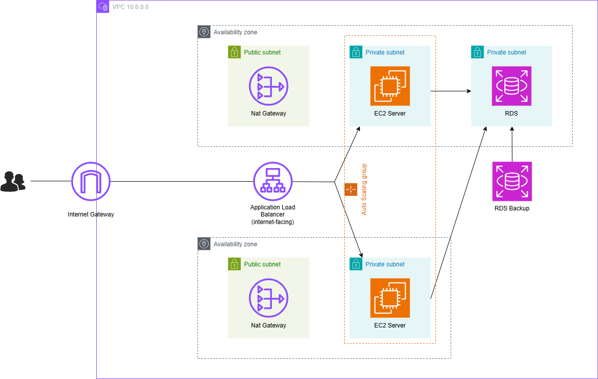

<h1><a href="https://chungvan2301.github.io/nguyenchungvan.github.io/vi/"> Triển khai ứng dụng Java Spring Boot trên EC2 trong VPC</a></h1>
	    
<h3 id="tổng-quan">Tổng quan</h3>

Workshop này được thiết kế nhằm cung cấp cho người đọc kiến thức và kinh nghiệm thực tế trong việc triển khai ứng dụng Java Spring Boot trên EC2 instance trong Virtual Private Cloud (VPC). Bài lab sẽ tập trung vào các biện pháp thực hành triển khai ứng dụng bảo mật và có quy mô linh hoạt trong môi trường mạng được kiểm soát, sử dụng các dịch vụ AWS.

<h3 id="nội-dung">Nội dung</h3>
<ol>
<li><a href="https://chungvan2301.github.io/nguyenchungvan.github.io/vi/1-introduce/">Giới thiệu</a></li>
<li><a href="https://chungvan2301.github.io/nguyenchungvan.github.io/vi/2-prerequiste/" >Các bước chuẩn bị</a></li>
<li><a href="https://chungvan2301.github.io/nguyenchungvan.github.io/vi/3-accessibilitytoinstances/" >Triển khai ứng dụng Spring Boot trên EC2 Instance</a></li>
<li><a href="https://chungvan2301.github.io/nguyenchungvan.github.io/vi/6-cleanup/" >Dọn dẹp tài nguyên</a></li>
</ol>
	
  
        

